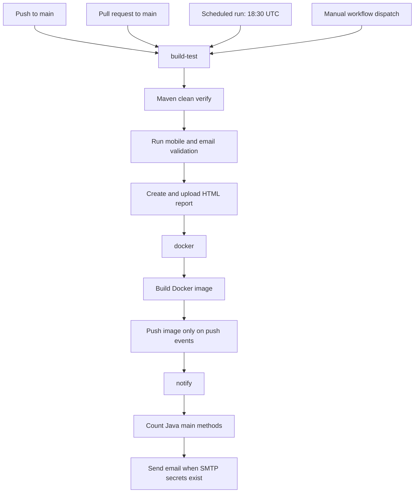
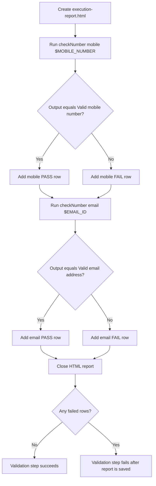
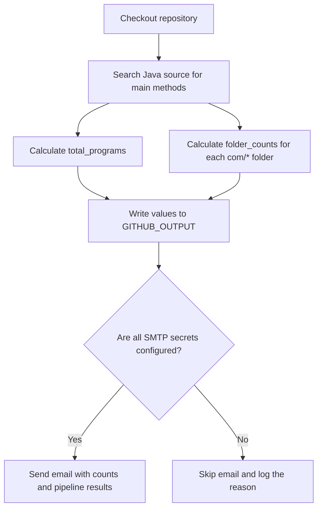
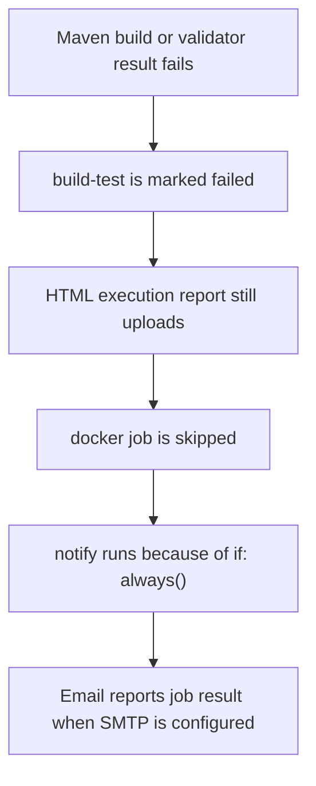

# Java End-to-End CI Pipeline Guide

This document describes the design and behaviour of the
`.github/workflows/java-end-to-end_ci.yml` workflow.

## Pipeline Overview



## Triggers and Shared Values

The workflow runs for pushes and pull requests to `main`, every day at `18:30` UTC, and when started manually with `workflow_dispatch` from the GitHub Actions page.

| Variable | Purpose |
|---|---|
| `IMAGE_NAME` | Base GitHub Container Registry image name. |
| `MOBILE_NUMBER` | Sample input for the mobile-number validation program. |
| `EMAIL_ID` | Sample input for the email-address validation program. |

The mobile number and email address are workflow environment variables, not values hard-coded into the Java command. Update them in the top-level `env` section to try different known-valid examples.

## Job Details

### `build-test`

| Step | Description |
|------|-------------|
| Checkout | `actions/checkout@v4` |
| Set up JDK 21 | Temurin distribution with Maven cache |
| Build and test | Runs `mvn -B clean verify` in `demo/`; it cleans old output, compiles source, runs configured tests, and verifies the build. |
| Execute validators | Runs `checkNumber` once for the mobile scenario and once for the email scenario. |
| Create report | Writes `target/ci-reports/execution-report.html` with each program's input, output, and pass/fail result. |
| Upload artifacts | Uploads the HTML as `java-execution-report` and Surefire XML as `surefire-reports`. |

### `docker`

| Step | Description |
|------|-------------|
| Set push flag | Output `pushed=true` only on `push` events |
| GHCR login | `docker/login-action@v3` using `GITHUB_TOKEN` (push only) |
| Build image | Tags `ghcr.io/<owner>/java-project:<sha>` and `:latest` |
| Push images | Executed only when `github.event_name == 'push'` |

### `notify`

Runs after both previous jobs regardless of their outcome (`if: always()`).

The email includes:
- Repo, branch, commit SHA, trigger event
- Result of each upstream job
- Full Docker image name and both tags
- Whether images were pushed

## Required Secrets

| Secret | Purpose |
|--------|---------|
| `SMTP_SERVER` | SMTP host (e.g. `smtp.gmail.com`) |
| `SMTP_PORT` | SMTP port (e.g. `587`) |
| `SMTP_USERNAME` | SMTP login username |
| `SMTP_PASSWORD` | SMTP login password / app password |
| `SMTP_FROM` | Sender email address |
| `SMTP_TO` | Recipient email address |

If any secret is missing the email step is skipped gracefully.

## Docker Image Registry

Images are stored in the GitHub Container Registry (GHCR):

```
ghcr.io/<owner>/java-project:<git-sha>
ghcr.io/<owner>/java-project:latest
```

`<owner>` is resolved automatically from `github.repository_owner`.

Images are pushed **only** on `push` to `main`.  
Pull-request runs build the image locally for validation but do **not** push.

## Program Execution and HTML Report

The validation-report step runs after Maven. It is marked `if: always()`, so it still creates a report if the Maven build fails. This preserves useful failure information rather than skipping the report entirely.



### Executed Java commands

```bash
java -cp target/classes com.regularExpressions.checkNumber mobile "$MOBILE_NUMBER"
java -cp target/classes com.regularExpressions.checkNumber email "$EMAIL_ID"
```

| Part | Explanation |
|---|---|
| `-cp target/classes` | Uses Maven's compiled class directory as Java's classpath. |
| `com.regularExpressions.checkNumber` | The fully qualified class name containing `main`. |
| `mobile` / `email` | Selects the validation path in `checkNumber`. |
| `$MOBILE_NUMBER` / `$EMAIL_ID` | Provides configurable inputs from the workflow environment. |
| `output=$(...)` | Captures the text printed by the Java program. |
| `failures` | Counts unexpected results. The job fails only after both scenarios have been recorded. |

The generated HTML table includes the program name, scenario, input, actual output, and a `PASS` or `FAIL` result for each execution.

### Downloading the report

The pipeline uploads this file as the `java-execution-report` artifact:

```text
demo/target/ci-reports/execution-report.html
```

Open a completed GitHub Actions run and download `java-execution-report` from the **Artifacts** section. The report is generated on the GitHub runner, so it does not appear as a committed file in the repository.

## Program Counts in the Email

Before sending the email, the `notify` job checks out the source code and scans `demo/src/main/java/com` for methods declared as:

```text
public static void main(...)
```



| Generated value | Meaning |
|---|---|
| `total_programs` | Number of declared `main` methods found across the Java source tree. |
| `folder_counts` | `main`-method totals for each top-level source folder, including `advanced`, `collections`, and `regularExpressions`. |

### How the count is calculated

The workflow uses `grep` to find the `main` method signature and `wc -l` to count the matching lines:

```bash
main_pattern='public[[:space:]]+static[[:space:]]+void[[:space:]]+main[[:space:]]*\('
total_programs=$(grep -R -E -h "$main_pattern" "demo/src/main/java/com" | wc -l)
```

| Command part | Explanation |
|---|---|
| `main_pattern` | Regex that recognizes `public static void main(` even when spaces or tabs differ. |
| `grep -R` | Searches recursively through the Java source folders. |
| `-E` | Enables extended regular-expression syntax. |
| `-h` | Hides file names so only matching method declarations are counted. |
| `wc -l` | Counts the matching lines, producing the total number of entry points. |

The `for folder in "$source_root"/*` loop repeats the same search for every immediate folder under `com`. For example, it separately counts `com/advanced`, `com/collections`, and `com/regularExpressions`, then combines them into `folder_counts`.

This count measures **runnable Java entry points**, not Maven/JUnit test cases. A Java class is counted only when it declares `public static void main(...)`; helper classes and regular test methods are not included.

### Example email content

At the time of writing, the source scan produces a total of `261` main methods. The email renders the dynamically calculated values in this form:

```text
Java Program Counts
-------------------
Total main methods in repository : 261
By top-level source folder        : advanced: 89; collections: 3; examples: 1; exceptionHandling: 19; flowcontrol: 6; fundamentals: 36; imports: 4; javaIOPackage: 15; javalangPackage: 32; objectoriented: 51; regularExpressions: 5;
```

These numbers change automatically as programs are added or removed; the values above are only an example from the current repository state.

The values are recalculated for every workflow run. They are not hard-coded. If one Java file declares more than one `main` method, each entry point is included in the total.

The email now contains a **Java Program Counts** section with the total and per-folder summary, in addition to repository details, job results, Docker tags, and image push status.

## Failure Behavior



This behavior makes failures diagnosable: execution output is visible in the workflow log, the HTML artifact records each validator result, Surefire XML is retained when available, and the email can report the final status.
