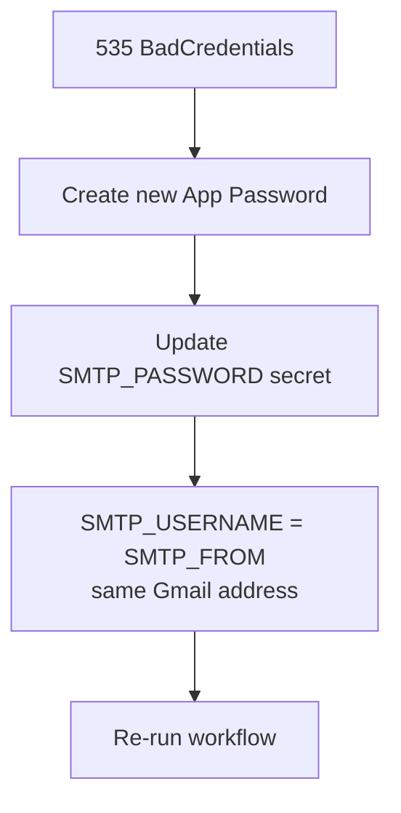
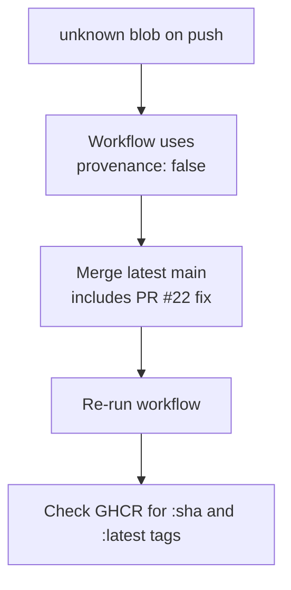
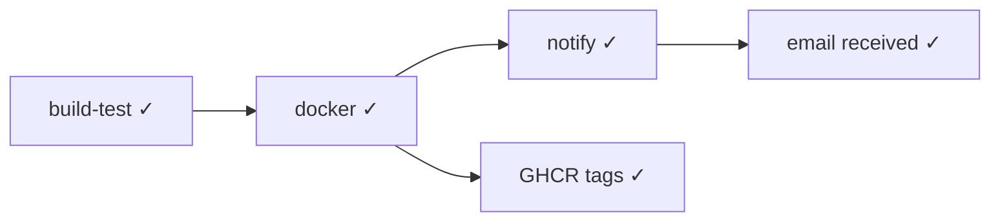

# Java E2E CI — Quick Runbook

<!-- TOC -->
- [Java E2E CI — Quick Runbook](#java-e2e-ci--quick-runbook)
	- [Trigger the pipeline manually](#trigger-the-pipeline-manually)
	- [Check build results](#check-build-results)
	- [Download Surefire test reports](#download-surefire-test-reports)
	- [Pull the Docker image](#pull-the-docker-image)
	- [Secrets setup](#secrets-setup)
	- [Common issues](#common-issues)
	- [Failure resolution guide](#failure-resolution-guide)
<!-- /TOC -->

## Trigger the pipeline manually

The workflow runs automatically on:
- `push` to `main`
- `pull_request` targeting `main`

To re-run a failed workflow via GitHub UI:  
**Actions → select run → Re-run all jobs**

## Check build results

```bash
# List recent workflow runs (requires gh CLI)
gh run list --workflow java-end-to-end_ci.yml
```

## Download Surefire test reports

```bash
gh run download <run-id> --name surefire-reports --dir /tmp/surefire-reports
```

## Pull the Docker image

```bash
# Latest
docker pull ghcr.io/<owner>/java-project:latest

# Specific commit
docker pull ghcr.io/<owner>/java-project:<git-sha>
```

## Secrets setup

Navigate to **Settings → Secrets and variables → Actions** and add:

| Secret          | Example value        |
| --------------- | -------------------- |
| `SMTP_SERVER`   | `smtp.gmail.com`     |
| `SMTP_PORT`     | `587`                |
| `SMTP_USERNAME` | `you@gmail.com`      |
| `SMTP_PASSWORD` | `abcdefghijklmnop`   |
| `SMTP_FROM`     | `you@gmail.com`      |
| `SMTP_TO`       | `team@example.com`   |

### Gmail setup (required for `smtp.gmail.com`)

Google rejects regular account passwords with error `535-5.7.8 BadCredentials`. Use an **App Password** instead:

1. Turn on [2-Step Verification](https://myaccount.google.com/signinoptions/two-step-verification) for the Gmail account.
2. Open [App Passwords](https://myaccount.google.com/apppasswords) and create one (App: **Mail**, Device: **Other** → `GitHub Actions`).
3. Copy the 16-character password into the `SMTP_PASSWORD` secret (spaces are optional; the workflow removes them).
4. Set `SMTP_USERNAME` and `SMTP_FROM` to the **same** full Gmail address (`you@gmail.com`).
5. Use port `587` (STARTTLS) or `465` (SSL).

## Common issues

| Symptom                    | Fix                                                                                                        |
| -------------------------- | ---------------------------------------------------------------------------------------------------------- |
| `535-5.7.8 BadCredentials` | Use a Gmail **App Password**, not your login password. Ensure `SMTP_FROM` matches `SMTP_USERNAME`.        |
| Email step skipped         | One or more SMTP secrets are missing — add them all                                                        |
| Docker push `unknown blob` | GHCR rejects BuildKit provenance manifests — workflow uses `provenance: false` on build-push |
| Docker push `unauthorized` | Ensure the repo package visibility allows write via `GITHUB_TOKEN`                                         |
| Surefire artifact empty    | No `*.xml` files found — this is normal when there are no tests; the step uses `if-no-files-found: ignore` |
| `mvn -B test` fails        | Fix compilation errors or failing unit tests in `demo/` before merging                                     |

For full failure analysis with diagrams, see [java-e2e-ci-pipeline-guide.md — Troubleshooting Known Failures](java-e2e-ci-pipeline-guide.md#troubleshooting-known-failures).

## Failure resolution guide

### 1. Gmail SMTP — `535 BadCredentials`

**When it happens:** `notify` job → `Send email notification` step fails with `535-5.7.8 ... gsmtp`.

**Why:** Gmail rejected the login — usually a regular password instead of an App Password, or a newly generated App Password not yet saved in GitHub secrets.



**Fix checklist:**

1. [Enable 2-Step Verification](https://myaccount.google.com/signinoptions/two-step-verification)
2. [Create App Password](https://myaccount.google.com/apppasswords) → Mail / Other → `GitHub Actions`
3. Update `SMTP_PASSWORD` in repo secrets (**old App Password stops working immediately**)
4. Set `SMTP_USERNAME` and `SMTP_FROM` to the same `@gmail.com` address
5. Re-run: **Actions → select run → Re-run all jobs**

---

### 2. GHCR Docker push — `unknown blob`

**When it happens:** `docker` job → push fails after layers upload with `unknown blob`.

**Why:** Docker BuildKit attaches provenance attestation manifests that GHCR rejects.



**Fix:** Ensure `main` includes the `docker/build-push-action@v6` step with `provenance: false` and `sbom: false`. No secret changes required.

**Verify images:**

```bash
docker pull ghcr.io/chaitussm/java-project:latest
```

---

### 3. Healthy run checklist



```bash
gh run list --workflow java-end-to-end_ci.yml --limit 1
gh run view <run-id> --json jobs --jq '.jobs[] | {name,conclusion}'
```
